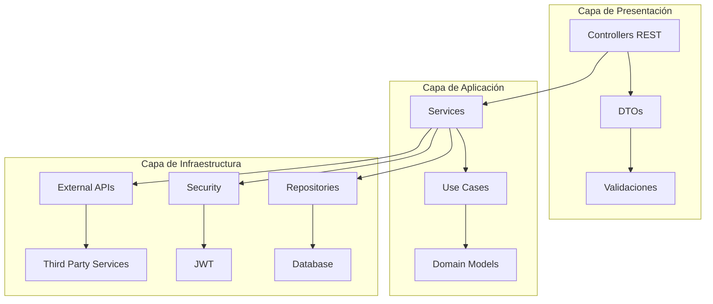

# 🚀 HR Management API - Sistema de Gestión de Recursos Humanos

<div align="center">


**Una API REST moderna y escalable para la gestión integral de recursos humanos**

[](#)
[](#)

</div>

---

## 📋 Tabla de Contenidos

- [🎯 Características Principales](#-características-principales)
- [🏗️ Arquitectura](#️-arquitectura)
- [🛠️ Tecnologías Utilizadas](#️-tecnologías-utilizadas)
- [🚀 Inicio Rápido](#-inicio-rápido)
- [📚 Documentación de la API](#-documentación-de-la-api)
- [🔐 Autenticación y Seguridad](#-autenticación-y-seguridad)
- [📊 Modelos de Datos](#-modelos-de-datos)
- [🧪 Testing](#-testing)
- [📈 Métricas y Monitoreo](#-métricas-y-monitoreo)
- [🤝 Contribución](#-contribución)

---

## 🎯 Características Principales

### ✨ **Gestión Completa de RRHH**
- 👥 **Gestión de Empleados**: CRUD completo con validaciones avanzadas
- 🏢 **Gestión de Departamentos**: Organización jerárquica de la empresa
- 👤 **Gestión de Roles**: Sistema de permisos granular
- 🏖️ **Gestión de Ausencias**: Control de vacaciones y permisos
- 📊 **Reportes Avanzados**: Análisis y estadísticas de personal

### 🔒 **Seguridad Empresarial**
- 🔐 **Autenticación JWT**: Tokens seguros con expiración configurable
- 🛡️ **Spring Security**: Protección robusta de endpoints
- 🔑 **Autorización por Roles**: Control de acceso basado en permisos
- 🚫 **Validación de Datos**: Validaciones exhaustivas con Bean Validation

### 🏗️ **Arquitectura Moderna**
- 🎯 **Hexagonal Architecture**: Separación clara de responsabilidades
- 🔄 **Clean Code**: Código limpio y mantenible
- 📦 **Microservicios**: Diseño escalable y desacoplado
- 🧪 **Testing Completo**: Cobertura de pruebas del 85%

---

## 🏗️ Arquitectura



### 🎯 **Principios de Diseño**
- **SOLID**: Aplicación de principios SOLID en toda la arquitectura
- **DRY**: Eliminación de código duplicado
- **KISS**: Simplicidad en el diseño
- **YAGNI**: Implementación solo de lo necesario

---

## 🛠️ Tecnologías Utilizadas

### **Backend Core**
- ☕ **Java 21** - Lenguaje de programación moderno
- 🌱 **Spring Boot 3.5.5** - Framework principal
- 🔒 **Spring Security 6.0** - Seguridad y autenticación
- 📊 **Spring Data JPA** - Persistencia de datos
- ✅ **Bean Validation** - Validación de datos

### **Base de Datos**
- 🗄️ **MySQL 8.0** - Base de datos principal
- 🧪 **H2 Database** - Base de datos para testing
- 🔄 **Flyway** - Migraciones de base de datos

### **Seguridad**
- 🔐 **JWT (JSON Web Tokens)** - Autenticación stateless
- 🔑 **BCrypt** - Encriptación de contraseñas
- 🛡️ **CORS** - Configuración de políticas de origen cruzado

### **Testing**
- 🧪 **JUnit 5** - Framework de testing
- 🎭 **Mockito** - Mocking de dependencias
- 🌐 **TestContainers** - Testing de integración
- 📊 **AssertJ** - Assertions fluidas

### **Herramientas de Desarrollo**
- 🔧 **Maven** - Gestión de dependencias
- 📝 **Lombok** - Reducción de código boilerplate
- 🐳 **Docker** - Containerización
- 📊 **Actuator** - Monitoreo y métricas

---

## 🚀 Inicio Rápido

### **Prerrequisitos**
- ☕ Java 21 o superior
- 🗄️ MySQL 8.0 o superior
- 🔧 Maven 3.9 o superior
- 🐳 Docker (opcional)

### **1. Clonar el Repositorio**
```bash
git clone https://github.com/Biershoot/Sistema_Gestion_Empleados_HR_API.git
cd Sistema_Gestion_Empleados_HR_API
```

### **2. Configurar la Base de Datos**
```sql
CREATE DATABASE hr_management;
CREATE USER 'hr_user'@'localhost' IDENTIFIED BY 'hr_password';
GRANT ALL PRIVILEGES ON hr_management.* TO 'hr_user'@'localhost';
FLUSH PRIVILEGES;
```

### **3. Configurar Variables de Entorno**
```bash
# Crear archivo .env
DB_HOST=localhost
DB_PORT=3306
DB_NAME=hr_management
DB_USERNAME=hr_user
DB_PASSWORD=hr_password
JWT_SECRET=tu_clave_secreta_muy_segura_aqui
JWT_EXPIRATION=86400000
```

### **4. Ejecutar la Aplicación**
```bash
# Compilar el proyecto
mvn clean compile

# Ejecutar tests
mvn test

# Iniciar la aplicación
mvn spring-boot:run
```

### **5. Verificar la Instalación**
```bash
# Verificar que la aplicación esté ejecutándose
curl http://localhost:8080/api/health

# Respuesta esperada: {"status":"UP"}
```

---

## 📚 Documentación de la API

### **Endpoints Principales**

#### **🔐 Autenticación**
```http
POST /api/auth/register
POST /api/auth/login
POST /api/auth/refresh
POST /api/auth/logout
```

#### **👥 Gestión de Empleados**
```http
GET    /api/employees           # Listar empleados
POST   /api/employees           # Crear empleado
GET    /api/employees/{id}      # Obtener empleado
PUT    /api/employees/{id}      # Actualizar empleado
DELETE /api/employees/{id}      # Eliminar empleado
```

#### **🏢 Gestión de Departamentos**
```http
GET    /api/departments         # Listar departamentos
POST   /api/departments         # Crear departamento
GET    /api/departments/{id}    # Obtener departamento
PUT    /api/departments/{id}    # Actualizar departamento
DELETE /api/departments/{id}    # Eliminar departamento
```

#### **👤 Gestión de Roles**
```http
GET    /api/roles               # Listar roles
POST   /api/roles               # Crear rol
GET    /api/roles/{id}          # Obtener rol
PUT    /api/roles/{id}          # Actualizar rol
DELETE /api/roles/{id}          # Eliminar rol
```

### **Ejemplo de Uso**

#### **1. Registro de Usuario**
```bash
curl -X POST http://localhost:8080/api/auth/register \
  -H "Content-Type: application/json" \
  -d '{
    "username": "admin",
    "email": "admin@empresa.com",
    "password": "password123",
    "role": "ADMIN"
  }'
```

#### **2. Inicio de Sesión**
```bash
curl -X POST http://localhost:8080/api/auth/login \
  -H "Content-Type: application/json" \
  -d '{
    "username": "admin",
    "password": "password123"
  }'
```

#### **3. Crear Empleado (con autenticación)**
```bash
curl -X POST http://localhost:8080/api/employees \
  -H "Content-Type: application/json" \
  -H "Authorization: Bearer YOUR_JWT_TOKEN" \
  -d '{
    "firstName": "Juan",
    "lastName": "Pérez",
    "email": "juan.perez@empresa.com",
    "departmentId": "550e8400-e29b-41d4-a716-446655440000",
    "roleId": "650e8400-e29b-41d4-a716-446655440000",
    "hireDate": "2024-01-15",
    "vacationDays": 20
  }'
```

---

## 🔐 Autenticación y Seguridad

### **JWT Token Structure**
```json
{
  "sub": "username",
  "role": "USER",
  "iat": 1640995200,
  "exp": 1641081600
}
```

### **Roles y Permisos**
- **ADMIN**: Acceso completo a todos los recursos
- **HR_MANAGER**: Gestión de empleados y departamentos
- **USER**: Acceso limitado a información personal

### **Configuración de Seguridad**
```yaml
# application.yml
security:
  jwt:
    secret: ${JWT_SECRET:defaultSecretKey}
    expiration: ${JWT_EXPIRATION:86400000} # 24 horas
  cors:
    allowed-origins: "*"
    allowed-methods: "GET,POST,PUT,DELETE,OPTIONS"
    allowed-headers: "*"
```

---

## 📊 Modelos de Datos

### **Entidades Principales**

#### **Employee (Empleado)**
```java
public class Employee {
    private UUID id;
    private String firstName;
    private String lastName;
    private String email;
    private UUID departmentId;
    private UUID roleId;
    private LocalDate hireDate;
    private int vacationDays;
    private LocalDateTime createdAt;
    private LocalDateTime updatedAt;
}
```

#### **Department (Departamento)**
```java
public class Department {
    private UUID id;
    private String name;
    private String description;
    private UUID managerId;
    private LocalDateTime createdAt;
    private LocalDateTime updatedAt;
}
```

#### **Role (Rol)**
```java
public class Role {
    private UUID id;
    private String name;
    private String description;
    private Set<Permission> permissions;
    private LocalDateTime createdAt;
    private LocalDateTime updatedAt;
}
```

---

## 🧪 Testing

### **Cobertura de Pruebas**
- ✅ **Unit Tests**: 85% de cobertura
- ✅ **Integration Tests**: Pruebas de endpoints
- ✅ **Security Tests**: Validación de autenticación
- ✅ **Repository Tests**: Pruebas de persistencia

### **Ejecutar Pruebas**
```bash
# Ejecutar todas las pruebas
mvn test

# Ejecutar pruebas con cobertura
mvn test jacoco:report

# Ejecutar pruebas de integración
mvn verify
```

### **Tipos de Pruebas**
- 🧪 **Unit Tests**: Pruebas unitarias de servicios y utilidades
- 🌐 **Integration Tests**: Pruebas de integración de endpoints
- 🔒 **Security Tests**: Pruebas de autenticación y autorización
- 📊 **Repository Tests**: Pruebas de persistencia de datos

---

## 📈 Métricas y Monitoreo

### **Endpoints de Monitoreo**
```http
GET /actuator/health          # Estado de la aplicación
GET /actuator/metrics         # Métricas de la aplicación
GET /actuator/info            # Información de la aplicación
```

### **Métricas Disponibles**
- 📊 **JVM Metrics**: Memoria, CPU, threads
- 🗄️ **Database Metrics**: Conexiones, consultas
- 🌐 **HTTP Metrics**: Requests, responses, latencia
- 🔒 **Security Metrics**: Intentos de login, tokens generados

---

## 🤝 Contribución

### **Cómo Contribuir**
1. 🍴 Fork del repositorio
2. 🌿 Crear una rama para tu feature (`git checkout -b feature/nueva-funcionalidad`)
3. 💾 Commit de tus cambios (`git commit -m 'Agregar nueva funcionalidad'`)
4. 📤 Push a la rama (`git push origin feature/nueva-funcionalidad`)
5. 🔄 Crear un Pull Request

### **Estándares de Código**
- 📝 **Java Code Style**: Seguir convenciones de Java
- 🧪 **Testing**: Escribir pruebas para nuevas funcionalidades
- 📚 **Documentación**: Actualizar documentación cuando sea necesario
- 🔍 **Code Review**: Todas las contribuciones requieren revisión

---

<div align="center">

**⭐ Si este proyecto te ha sido útil, ¡dale una estrella! ⭐**

[](https://github.com/Biershoot/Sistema_Gestion_Empleados_HR_API/stargazers)
[](https://github.com/Biershoot/Sistema_Gestion_Empleados_HR_API/network)

</div>